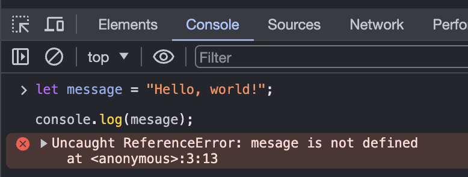
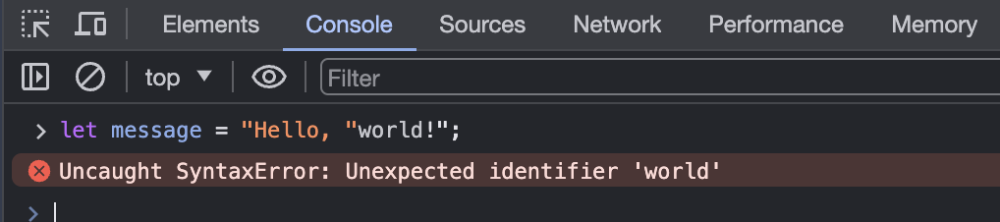

# 01: Introduction, Environment Setup, and Data Types

#### [Table of Contents](#table-of-contents)
  - [Introduction](#introduction)
  - [Variables](#variables)
  - [Operators](#operators)
  - [Conditionals](#conditionals)
  - [Overview](#overview)

>  <details open>
> <summary>Resources</summary>
>
> - [MDN Web Docs - JavaScript](https://developer.mozilla.org/en-US/docs/Web/JavaScript)
>   - MDN - Quick & accurate documentation site you should get used to
> - [MDN Web Docs - Ledarn JavaScript](https://developer.mozilla.org/en-US/docs/Learn/JavaScript/First_steps)
>   - Their educational materials
> - [W3Schools JavaScript Reference](https://www.w3schools.com/jsref/)
>   - More beginner-friendly -- but less comprehensive documentation site
> - [W3Schools JavaScript Examples](https://www.w3schools.com/js/js_examples.asp)
> - [javascript.info](https://javascript.info)
>   - Gold standard of JavaScript education
>
> </details>

## Introduction

<div style="text-align:center">

</div>

<details open>
<summary>What is a Programming Language?</summary>

> A Programming Language is a **formal language that specifies a set of instructions.**
>
> A set of instructions create <u>computations, algorithms, applications</u>, etc.
>
> There are thousands different programming languages being used all around us.
>
> The most commonly used programming languages are Python, Java, JavaScript, C++, and C#. Programming languages are used to create websites, software, and applications, as well as to control machines and robots.

</details>

<details open>
<summary>What is JavaScript?</summary>

> JavaScript (JS) is a is a powerful programming language that can add interactivity to a website. It was invented by Brendan Eich.
>
> JavaScript is one of the **most popular modern web technologies!**. It is versatile and beginner-friendly. As your JavaScript skills grow, your websites will enter a new dimension of <u>power</u> and <u>creativity</u>. You'll be able to create games, animated 2D and 3D graphics, comprehensive database-driven apps, and much more!
>
> <details>
> <summary>Java vs. JavaScript, are they the same?</summary>
>
> > No, Java and JavaScript are different languages with different syntax, semantics, and use cases. Java is typically used for server-side development, while JavaScript is primarily used for client-side scripting in web browsers.
>
> </details>
>
> <details>
> <summary>What can we do with JavaScript?</summary>
>
> > With JavaScript, you can create interactive web pages, handle user input, manipulate HTML and CSS, perform asynchronous operations like AJAX requests, and much more.
>
> </details>
>
> <details>
> <summary>What can’t we do with JavaScript?</summary>
>
> > While JavaScript is powerful for client-side scripting, it cannot directly access the user's file system for security reasons. Additionally, it may not be suitable for CPU-intensive tasks or for developing standalone desktop applications.
>
> </details>

</details>

<details open>
<summary>How to run JavaScript code</summary>

> Remember, all JavaScript can be run in the browser. But let's practice using our IDE
>
> The simplest way to get started is to create an HTML file with the JavaScript code inside of it. Type the basic HTML skeleton into a file on your computer somewhere:
>
> ```html
> <!DOCTYPE html>
> <html>
>   <head>
>     <meta charset="UTF-8" />
>     <title>Page Title</title>
>   </head>
>   <body>
>     <script>
>       // Your JavaScript goes here!
>       console.log("Hello, World!");
>     </script>
>   </body>
> </html>
> ```
>
> Save and open this file up in a web browser (you can use “Live Server” on Visual Studio Code to do this!) and then open up the browser’s console by right-clicking on the blank webpage and selecting “Inspect” or “Inspect Element”. In the ‘Developer Tools’ pane find and select the ‘Console’ tab, where you should see the output of our console.log statement.
>
> 
>
> **console.log()** is the command to print something to the developer console in your browser. You can use this to print the results from any of the following exercises to the console.
>
> Another way to include JavaScript in a webpage is through an **external script**. This is very similar to linking external CSS docs to your website.
>
> ```html
> <script src="javascript.js"></script>
> ```
>
> JavaScript files have the extension .js similar to .css for stylesheets. External JavaScript files are used for more complex scripts.
>
> </details>

</details>

<details>
<summary>In-class Exercise #1</summary>

> <details>
> <summary>1. Create an html page on vs code. Add a div with an id inside the body element. Add a  script tag with some JavaScript on it
> </summary>
>
> ```html
> <!DOCTYPE html>
> <html lang="en">
>   <head>
>     <meta charset="UTF-8" />
>     <meta name="viewport" content="width=device-width, initial-scale=1.0" />
>     <title>My First HTML Page</title>
>   </head>
>   <body>
>     <div id="myDiv">
>       <!-- Your content here -->
>     </div>
>
>     <script>
>       // Your JavaScript code here
>     </script>
>   </body>
> </html>
> ```
>
> </details>
>
> 2. Add a file with some more JavaScript on it. Externally load that file via a script tag. Open it on a browser and make sure it works
>    
>
> </details>

</details>

> <details>
> <summary>Quiz</summary>
> <details>
> <summary>What is a programming language?</summary>
>
> > A programming language is a formal language for specifying instructions.
>
> </details>
>
> <details>
> <summary>What does JavaScript add to a website?</summary>
>
> > JavaScript adds interactivity to a website.
>
> </details>
>
> <details>
> <summary>Who invented JavaScript?</summary>
>
> > JavaScript was invented by Brendan Eich.
>
> </details>
>
> <details>
> <summary>What can you create with JavaScript as your skills grow?</summary>
>
> > As your JavaScript skills grow, you can create games, animations, comprehensive database-driven apps, and much more!
>
> </details>
>
> <details>
> <summary>Are Java and JavaScript the same?</summary>
>
> > No, Java and JavaScript are different languages with different syntax, semantics, and use cases.
>
> </details>
>
> <details>
> <summary>What can you not directly do with JavaScript?</summary>
>
> > You cannot directly access the user's file system with JavaScript for security reasons. Additionally, JavaScript may not be suitable for CPU-intensive tasks or for developing standalone desktop applications.
>
> </details>

---

## Variables

- Create and manipulate variables and values in JavaScript.

<details open>
<summary>What are Variables</summary>

> JavaScript variables are containers for storing data values. The data stored in a JavaScript variable can be of any data type, such as a string, a number, an array, an object, or a Boolean.
>
> 
>
> Variables allow us to store and manipulate data for use in our programs. They also help us to keep our code organized and make it easier to read.
>
> - `let x = 5;` // think like in algebra
> - `let y = 'text';` // can hold numbers, strings, booleans, functions
> - `let price = 100;` // can be initialized
> - `let price;` // or not initialized
> - `let price1;` // can have numbers in name, cannot start with numbers
> - `let Price;` // are case sensitive
> - `let pricePerCamel;` // standard is to use camel case\

</details>

<details open>
<summary>What are Expressions</summary>

> Expressions are combinations of values, variables, operators, and function calls that evaluate to a single value.
>
> They are the building blocks of JavaScript code and are used to perform computations or produce new values.
>
> Expressions can be as simple as a single value or as complex as a combination of multiple operators and operands.
>
> Examples:
>
> - `5 + 3` is a simple expression that evaluates to `8`.
> - `x * 2` is an expression that involves a variable `x` and an arithmetic operation, which evaluates to `10` if `x` is `5`.

</details>

<details open>
<summary>In-class Exercise #2: JavaScript Expressions and Variables</summary>

> **Exercise Description:**
>
> You are tasked with creating a simple JavaScript program that calculates the total price of items in a shopping cart. You'll utilize expressions and variables to achieve this task.
>
> **Requirements:**
>
> 1. Create a JavaScript file named `shoppingCart.js`.
> 2. Define variables to store the prices of three items in the shopping cart.
> 3. Use expressions to calculate the total price by adding the prices of all items.
> 4. Display the total price in the console.
>
> **Tips:**
>
> - Remember that expressions can involve arithmetic operations (+, -, \*, /).
> - Use descriptive variable names to represent the prices of items.
> - Ensure that your code is well-organized and easy to read.
> - Test your program with different item prices to verify its correctness.
>
> **Example:**
>
> ```javascript
> // Define item prices
> let item1Price = 20;
> let item2Price = 30;
> let item3Price = 15;
>
> // Calculate total price
> let totalPrice = item1Price + item2Price + item3Price;
>
> // Display total price
> console.log("Total Price:", totalPrice);
> ```
>
> **Challenge (Optional):**
>
> Enhance your program to include the quantity of each item in the shopping cart. Adjust the expressions accordingly to calculate the total price based on both item prices and quantities.

---

## Operators

<details open>
<summary>JavaScript Operators</summary>

> JavaScript operators are symbols that perform operations on operands. These operands can be values or variables. There are various types of operators in JavaScript.

> 1. **Assignment Operator (`=`)**: Assigns a value to a variable.
>    ```javascript
>    let x = 5;
>    ```

> 2. **Arithmetic Operators**: Perform arithmetic operations.
>    - Addition (`+`)
>    ```javascript
>    let sum = 5 + 3; // sum equals 8
>    ```
>    - Subtraction (`-`)
>    ```javascript
>    let difference = 5 - 3; // difference equals 2
>    ```
>    - Multiplication (`*`)
>    ```javascript
>    let product = 5 * 3; // product equals 15
>    ```
>    - Division (`/`)
>    ```javascript
>    let quotient = 6 / 2; // quotient equals 3
>    ```

> 3. **Comparison Operators**: Compare two values and return a boolean result.
>    - Equality (`==`, `===`)
>
> - The `==` operator checks for equality after converting both operands to a common type. It performs type coercion if the operands are of different types.
> - The `===` operator, known as the strict equality operator, checks for equality without type coercion. It returns true only if both the value and the type of the operands are the same.
>
> ```javascript
> // Example 1: Using ==
> console.log(5 == "5"); // true (Type coercion: string '5' is converted to number 5)
> console.log(0 == false); // true (Type coercion: boolean false is converted to number 0)
>
> // Example 2: Using ===
> console.log(5 === "5"); // false (Value and type are different)
> console.log(0 === false); // false (Value and type are different)
> ```
>
> - Inequality (`!=`, `!==`)
>
> ```javascript
> let isNotEqual = 5 !== "5"; // isNotEqual is true
> ```
>
> - Greater than (`>`)
>
> ```javascript
> let isGreater = 5 > 3; // isGreater is true
> ```
>
> - Less than (`<`)
>
> ```javascript
> let isLess = 3 < 5; // isLess is true
> ```

> 4. **Logical Operators**: Perform logical operations and return a boolean result.
>    - AND (`&&`)
>    ```javascript
>    let andResult = true && false; // andResult is false
>    ```
>    - OR (`||`)
>    ```javascript
>    let orResult = true || false; // orResult is true
>    ```
>    - NOT (`!`)
>    ```javascript
>    let notResult = !true; // notResult is false
>    ```

> 5. **Increment (`++`)**: Increases the value of a variable by 1.
>    ```javascript
>    let count = 0;
>    count++; // count is incremented by 1
>    ```

> 6. **Decrement (`--`)**: Decreases the value of a variable by 1.
>    ```javascript
>    let total = 10;
>    total--; // total is decremented by 1
>    ```

</details>

<details open>
<summary>In-class Exercise #3: JavaScript Operators</summary>

> **Exercise Description:**
>
> Your task is to create a simple JavaScript program that demonstrates the usage of various operators covered in the lesson.
>
> **Requirements:**
>
> 1. Create a JavaScript file named `operatorsDemo.js`.
> 2. Implement examples for each type of operator mentioned in the lesson:
>    - Assignment Operator (`=`)
>    - Arithmetic Operators: Addition (`+`), Subtraction (`-`), Multiplication (`*`), Division (`/`)
>    - Comparison Operators: Equality (`==`, `===`), Inequality (`!=`, `!==`), Greater than (`>`), Less than (`<`)
>    - Logical Operators: AND (`&&`), OR (`||`), NOT (`!`)
>    - Increment (`++`) and Decrement (`--`)
> 3. Use comments to explain each example and its expected output.
> 4. Test each example by running the JavaScript file in a browser console or a Node.js environment.
>
> **Tips:**
>
> - Start with simple examples and gradually increase complexity.
> - Ensure clarity and readability of your code by using descriptive variable names and comments.
> - Experiment with different values and scenarios to thoroughly understand how each operator works.
>
> **Example:**
>
> ```javascript
> // Assignment Operator (=)
> let x = 5;
>
> // Arithmetic Operators
> let sum = 5 + 3; // Addition (+)
> let difference = 5 - 3; // Subtraction (-)
> let product = 5 * 3; // Multiplication (*)
> let quotient = 6 / 2; // Division (/)
>
> // Comparison Operators
> let isEqual = 5 === "5"; // Equality (===)
> let isNotEqual = 5 !== "5"; // Inequality (!==)
> let isGreater = 5 > 3; // Greater than (>)
> let isLess = 3 < 5; // Less than (<)
>
> // Logical Operators
> let andResult = true && false; // AND (&&)
> let orResult = true || false; // OR (||)
> let notResult = !true; // NOT (!)
>
> // Increment (++)
> let count = 0;
> count++; // Increment count by 1
>
> // Decrement (--)
> let total = 10;
> total--; // Decrement total by 1
> ```
>
> **Challenge (Optional):**
>
> Implement additional examples that showcase more advanced usage of operators, such as combining multiple operators in a single expression or using operators in control flow statements.
>
> **Additional Resources:**
>
> - [MDN Web Docs: Expressions and Operators](https://developer.mozilla.org/en-US/docs/Web/JavaScript/Guide/Expressions_and_Operators)
>
> Happy coding!

</details>

## Conditionals

<details open>
<summary>What are conditionals?</summary>

> They test if an expression returns true or not.
>
> A very common form of conditionals is the if...else statement. For example:
>
> ```javascript
> let iceCream = "chocolate";
> if (iceCream === "chocolate") {
>   console.log("Yay, I love chocolate ice cream!");
> } else {
>   alert("Awwww, but chocolate is my favorite…");
> }
> ```

</details>

<details open>
<summary>In-class Exercise #4: JavaScript Conditionals</summary>

> **Exercise Description:**
>
> Your task is to create a simple JavaScript program that demonstrates the usage of conditional statements, specifically if...else statements.
>
> **Requirements:**
>
> 1. Create a JavaScript file named `conditionalsDemo.js`.
> 2. Implement examples for using if...else statements to make decisions based on conditions.
> 3. Use comments to explain each example and its expected output.
> 4. Test each example by running the JavaScript file in a browser console or a Node.js environment.
>
> **Tips:**
>
> - Start with simple examples and gradually increase complexity.
> - Ensure clarity and readability of your code by using descriptive variable names and comments.
> - Experiment with different conditions and scenarios to understand how conditional statements work.
>
> **Example:**
>
> ```javascript
> let temperature = 25;
>
> if (temperature > 30) {
>   console.log("It's a hot day!");
> } else if (temperature > 20) {
>   console.log("It's a pleasant day.");
> } else {
>   console.log("It's cold today.");
> }
> ```
>
> **Challenge (Optional):**
>
> Implement additional examples that involve nested if...else statements, switch statements, or ternary operators to handle more complex conditions.
>
> **Additional Resources:**
>
> - [MDN Web Docs: Control Flow](https://developer.mozilla.org/en-US/docs/Web/JavaScript/Guide/Control_flow_and_error_handling)
>
> Happy coding!

</details>

---

## Overview

<details open>
<summary>Overall Quiz</summary>

> <details>
> <summary>What are JavaScript operators used for?</summary>
>
> JavaScript operators are symbols that perform operations on operands. These operands can be values or variables. There are various types of operators in JavaScript.
>
> </details>
>
> <details>
> <summary>What is the difference between the `==` operator and the `===` operator in JavaScript?</summary>
>
> - The `==` operator checks for equality after converting both operands to a common type. It performs type coercion if the operands are of different types.
> - The `===` operator, known as the strict equality operator, checks for equality without type coercion. It returns true only if both the value and the type of the operands are the same.
>
> **Example:**
>
> ```javascript
> console.log(5 == "5"); // true (Type coercion: string '5' is converted to number 5)
> console.log(0 === false); // false (Value and type are different)
> ```
>
> </details>
>
> <details>
> <summary>What are variables used for in JavaScript?</summary>
>
> Variables allow us to store and manipulate data for use in our programs. They also help us to keep our code organized and make it easier to read.
>
> </details>
>
> <details>
> <summary>Describe the characteristics of JavaScript variables.</summary>
>
> JavaScript variables are containers for storing data values. The data stored in a JavaScript variable can be of any data type, such as a string, a number, an array, an object, or a Boolean.
>
> </details>
>
> <details>
> <summary>What types of data can be stored in a JavaScript variable?</summary>
>
> Any data type, such as a string, a number, an array, an object, or a Boolean, can be stored in a JavaScript variable.
>
> </details>
>
> <details>
> <summary>Java vs. JavaScript, are they the same?</summary>
>
> No, Java and JavaScript are different languages with different syntax, semantics, and use cases. Java is typically used for server-side development, while JavaScript is primarily used for client-side scripting in web browsers.
>
> </details>
>
> <details>
> <summary>What can we do with JavaScript?</summary>
>
> With JavaScript, you can create interactive web pages, handle user input, manipulate HTML and CSS, perform asynchronous operations like AJAX requests, and much more.
>
> </details>
>
> <details>
> <summary>What can’t we do with JavaScript?</summary>
>
> While JavaScript is powerful for client-side scripting, it cannot directly access the user's file system for security reasons. Additionally, it may not be suitable for CPU-intensive tasks or for developing standalone desktop applications.
>
> </details>
>
> <details>
> <summary>What does the `&&` operator do in JavaScript?</summary>
>
> The `&&` operator, known as the logical AND operator, returns true if both operands are true; otherwise, it returns false.
>
> **Example:**
>
> ```javascript
> let andResult = true && false; // andResult is false
> ```
>
> </details>
>
> <details>
> <summary>What does the `||` operator do in JavaScript?</summary>
>
> The `||` operator, known as the logical OR operator, returns true if at least one of the operands is true; otherwise, it returns false.
>
> **Example:**
>
> ```javascript
> let orResult = true || false; // orResult is true
> ```
>
> </details>
>
> <details>
> <summary>What does the `!=` operator do in JavaScript?</summary>
>
> The `!=` operator, known as the inequality operator, returns true if the operands are not equal; otherwise, it returns false.
>
> </details>
>
> <details>
> <summary>What does the `!==` operator do in JavaScript?</summary>
>
> The `!==` operator, known as the strict inequality operator, returns true if the operands are not equal and of the same type; otherwise, it returns false.
>
> </details>

</details>
